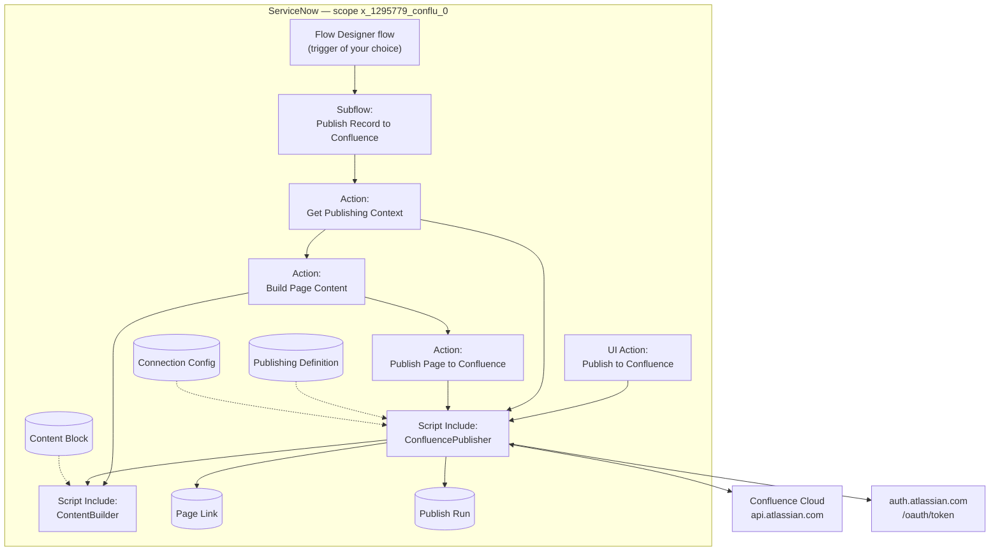
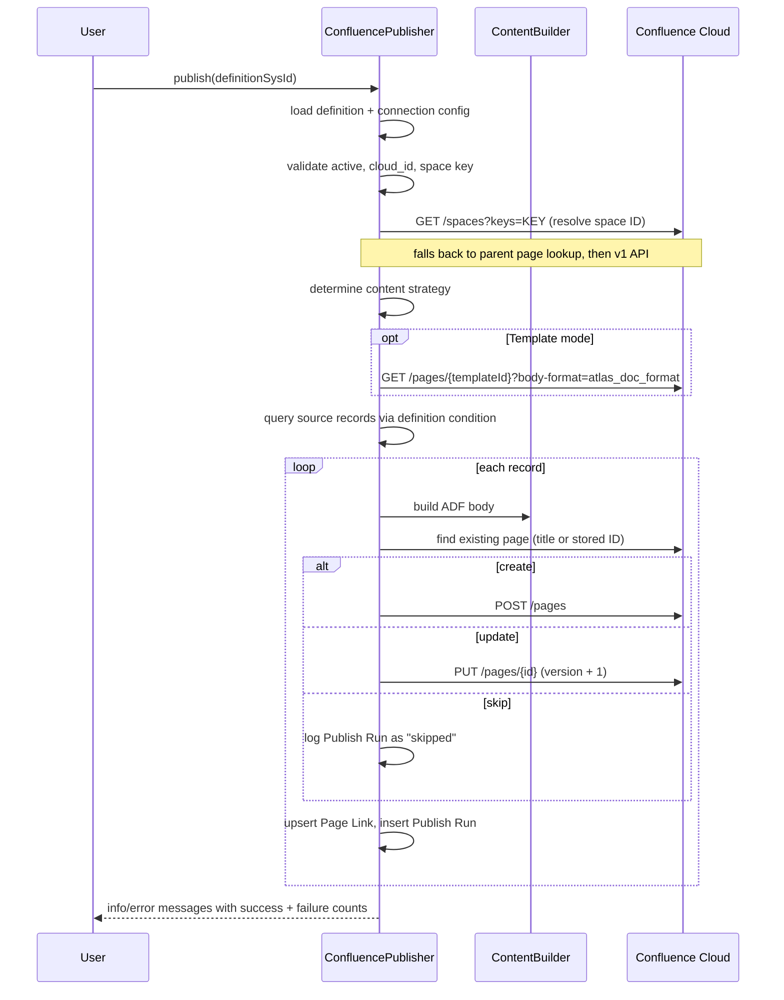
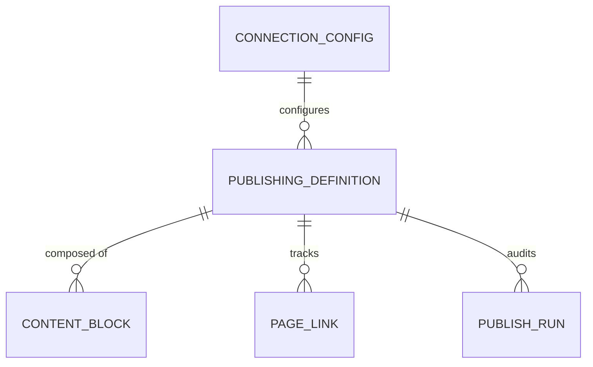

# Confluence Publisher

A ServiceNow scoped application that publishes record data from any ServiceNow table to **Atlassian Confluence Cloud** pages — either on demand from a form button, or automatically from Flow Designer.

|                    |                                                                                 |
| ------------------ | ------------------------------------------------------------------------------- |
| **Application**    | Confluence Publisher                                                            |
| **Scope**          | `x_1295779_conflu_0`                                                            |
| **Package sys_id** | `179c1ee2932e075045f0f3255d03d65f`                                              |
| **Confluence API** | Cloud REST API **v2** (`/wiki/api/v2/...`), with a v1 fallback for space lookup |
| **Page format**    | ADF (Atlas Document Format)                                                     |
| **Auth**           | Atlassian OAuth 2.0, `client_credentials` grant, service-account style          |

---

## Table of contents

- [What it does](#what-it-does)
- [Architecture](#architecture)
- [Setup](#setup)
- [Process flow](#process-flow)
- [Content strategies](#content-strategies)
- [Data model](#data-model)
- [Script Includes](#script-includes)
- [Flow Designer components](#flow-designer-components)
- [UI components](#ui-components)
- [Content block reference](#content-block-reference)
- [Placeholder syntax](#placeholder-syntax)
- [Troubleshooting](#troubleshooting)
- [Known gaps and cleanup candidates](#known-gaps-and-cleanup-candidates)
- [Repository layout](#repository-layout)

---

## What it does

You define a **Publishing Definition** that says: _"For records on this table matching this condition, build a page with this title and this content, and put it in this Confluence space."_

From there the app can:

- **Publish in bulk** — click a form button on the definition and every matching record gets a page.
- **Publish a single record from a flow** — call the `Publish Record to Confluence` subflow from any Flow Designer flow, business rule trigger, or scheduled job.
- **Create or update intelligently** — the app detects whether the page already exists (by title, or by a stored page ID) and either creates it, updates it with a new version, or skips it.
- **Track everything** — every attempt writes a **Publish Run** audit record; every successful page writes a **Page Link** record mapping the ServiceNow record to its Confluence page ID and version.

---

## Architecture



There are two entry points into the same engine:

| Entry point                                  | Scope of work                                       | Implementation                                                            |
| -------------------------------------------- | --------------------------------------------------- | ------------------------------------------------------------------------- |
| **UI Action** (`Publish to Confluence`)      | **All** records matching the definition's condition | `ConfluencePublisher.publish(definitionSysId)` — loops records internally |
| **Subflow** (`Publish Record to Confluence`) | **One** record                                      | Three Flow Actions, each calling into the same Script Includes            |

Both paths share `ConfluencePublisher` and `ContentBuilder`, so behaviour is consistent.

---

## Setup

### 1. Create the Atlassian OAuth 2.0 app

In the [Atlassian Developer Console](https://developer.atlassian.com/console/myapps/):

1. Create an app and enable the **Confluence** product.
2. Add the API scopes your integration needs — at minimum read/write on Confluence content and read on spaces (`read:page:confluence`, `write:page:confluence`, `read:space:confluence` for granular scopes).
3. Note the **Client ID** and **Client Secret**.
4. Authorize the app against your Confluence site so it has a service-account identity there.

> This app authenticates with the **`client_credentials`** grant and passes `audience=api.atlassian.com` on the token request. It is _not_ a per-user 3LO flow — the integration acts as a service account, so whatever that app principal can see in Confluence is what ServiceNow can publish to.

### 2. Find your Cloud ID

```
https://<your-site>.atlassian.net/_edge/tenant_info
```

Returns `{"cloudId":"..."}`. You'll need this for the Connection Config record.

### 3. Create the ServiceNow OAuth entity

**System OAuth → Application Registry → New → Connect to a third party OAuth Provider**

| Field              | Value                                                                          |
| ------------------ | ------------------------------------------------------------------------------ |
| Name               | `Confluence Publisher` (**must match exactly** — the code looks it up by name) |
| Client ID          | from Atlassian                                                                 |
| Client Secret      | from Atlassian                                                                 |
| Default Grant Type | Client Credentials                                                             |
| Token URL          | `https://auth.atlassian.com/oauth/token`                                       |
| Send Credentials   | As Request Body Parameters                                                     |
| Redirect URL       | `https://<your-instance>.service-now.com/oauth_redirect.do`                    |
| Application        | Confluence Publisher (so `sys_scope` matches)                                  |

`ConfluencePublisher._getAccessToken()` reads this record directly by `name = 'Confluence Publisher'` **and** `sys_scope = 179c1ee2932e075045f0f3255d03d65f`, decrypts the secret, and posts the token request itself (rather than going through `GlideOAuthClient`) so it can add the `audience` parameter Atlassian requires.

A default **OAuth Entity Profile** (`Confluence Publisher default_profile`, grant type `client_credentials`) ships with the app.

### 4. Create a Connection Config

**Confluence Publisher → Configuration → Connection Config → New**

| Field             | Example                                | Notes                                          |
| ----------------- | -------------------------------------- | ---------------------------------------------- |
| Name              | `Guardian Confluence`                  | Display value                                  |
| Site URL          | `https://your-site.atlassian.net/wiki` | Reference/documentation only                   |
| Cloud ID          | `1a2b3c4d-...`                         | **Required** — used to build every API URL     |
| Default Space Key | `PLATFORM`                             | Fallback when a definition doesn't set its own |

### 5. Create a Publishing Definition

**Confluence Publisher → Publishing Definitions → New**

| Field                    | Notes                                                                                             |
| ------------------------ | ------------------------------------------------------------------------------------------------- |
| Name                     | Label for the definition                                                                          |
| Connection Config        | **Mandatory** reference to the record above                                                       |
| Source Table             | The ServiceNow table to publish from                                                              |
| Condition                | Encoded query used **only** by the bulk (UI Action) path to select records                        |
| Target Space Key         | **Mandatory**; overrides the Connection Config default                                            |
| Parent Page ID           | Optional; new pages are nested under it. Also used as a fallback for space ID resolution          |
| Template Page ID         | Optional; if set, switches to **Template mode**                                                   |
| Title Template           | **Mandatory**; supports `${field}` placeholders, e.g. `Incident ${number} — ${short_description}` |
| Version Message Template | Optional; supports `${field}`. Defaults to `Updated from ServiceNow`                              |
| Mode                     | `create` / `update` / `upsert` (default `upsert`)                                                 |
| Match Strategy           | `by_title_in_space` (default) or `by_stored_page_id`                                              |
| Active                   | Must be `true` — the UI Action is hidden and `publish()` aborts otherwise                         |

Selecting a Connection Config auto-fills **Target Space Key** from its default (client script).

### 6. Add Content Blocks (unless using Template mode)

**Related list on the Publishing Definition → Content Blocks → New.** Blocks render in `sys_created_on` order. See [Content block reference](#content-block-reference).

### 7. Publish

Click **Publish to Confluence** on the definition form, or wire the subflow into a flow.

### 8. Cross-scope privileges

The app ships with `sys_scope_privilege` records granting read on `oauth_entity`, `oauth_entity_profile`, `problem`, and `sc_task`, plus execute on the `RESTMessageV2`, `GlideOAuthClient`, and `GlideRecord` scriptables it uses. **Publishing from a source table not already covered will prompt for a new cross-scope privilege on first run** — approve it in _System Applications → Application Restricted Caller Access_.

---

## Process flow

### Bulk path (UI Action)



### Single-record path (Flow Designer)

The `Publish Record to Confluence` subflow, step by step:

| #   | Step                           | What happens                                                                                                               |
| --- | ------------------------------ | -------------------------------------------------------------------------------------------------------------------------- |
| 1   | **Get Publishing Context**     | Loads definition + config, resolves the title template, resolves the space ID, and determines `create` / `update` / `skip` |
| 2   | **If** `operation = skip`      | Assigns subflow outputs `status = skipped`, `error_message = "Operation determined as skip - no publish needed"`           |
| 3   | **Build Page Content**         | Produces the ADF JSON string via `ContentBuilder`                                                                          |
| 4   | **Publish Page to Confluence** | Makes the create/update call, writes the Publish Run and Page Link                                                         |
| 5   | **Assign Subflow Outputs**     | Maps `page_id`, `page_url`, `status`, `error_message` from the publish step                                                |

> ⚠️ See [Known gaps](#known-gaps-and-cleanup-candidates) — the `If skip` branch assigns outputs but does not stop the flow, so steps 3–5 still execute.

### Create vs. update vs. skip

`_determineOperation()` combines **Match Strategy** (how to find an existing page) with **Mode** (what to do about it):

|                   | Existing page found | No existing page |
| ----------------- | ------------------- | ---------------- |
| **Mode = create** | `skip`              | `create`         |
| **Mode = update** | `update`            | `skip`           |
| **Mode = upsert** | `update`            | `create`         |

**Match strategies:**

- `by_title_in_space` — queries `GET /spaces/{spaceId}/pages?title=...&status=current`. Resilient if the Page Link table is wiped, but does one API call per record and will collide with same-titled pages created by hand.
- `by_stored_page_id` — reads the **Page Link** record for `(source_table, source_id, publishing_definition)` and verifies the page still exists. Faster and title-change safe, but a deleted Page Link means a duplicate page gets created.

### Space ID resolution

Confluence v2 needs a numeric space **ID**, not the space **key**. `_getSpaceId()` tries three things in order:

1. `GET /wiki/api/v2/spaces?keys={key}`
2. If a **Parent Page ID** is configured — `GET /wiki/api/v2/pages/{parentId}` and read `spaceId` off the page _(most reliable for personal spaces, where the v2 keys lookup often returns an empty result set)_
3. `GET /wiki/rest/api/space/{key}` (v1 fallback)

Every attempt is logged via `gs.info` / `gs.error`.

---

## Content strategies

The app picks one of three, in this priority order:

### 1. Custom ADF (highest priority)

Pass a full ADF document object as the second argument:

```javascript
var adf = {
  type: "doc",
  version: 1,
  content: [
    {
      type: "heading",
      attrs: { level: 1 },
      content: [{ type: "text", text: "Change ${number}" }],
    },
    { type: "paragraph", content: [{ type: "text", text: "${description}" }] },
  ],
};

new x_1295779_conflu_0.ConfluencePublisher().publish(
  "<definition_sys_id>",
  adf,
);
```

The document is deep-cloned per record and `${field}` placeholders inside text nodes are resolved against that record. Content Blocks are ignored.

> Only reachable from server script — the Flow Action `Build Page Content` does not expose this mode.

### 2. Template mode

Triggered when **Template Page ID** is set on the definition.

1. The template page's ADF is fetched via `?body-format=atlas_doc_format`.
2. `ContentBuilder.buildBlockMap()` renders every Content Block into ADF nodes, keyed by block **Name**.
3. `resolveTemplateDocument()` walks the template:
   - A paragraph or heading whose text is _essentially just_ `${placeholders}` (nothing but whitespace and `- : ,` left after stripping them) is **replaced wholesale** by the matching block's ADF nodes.
   - Anything else has its placeholders **resolved inline** as text. A block that renders to a single simple paragraph gets inlined as plain text; a complex block (table, list, panel) that can't be inlined renders the literal marker `[Block: name]`.
   - Placeholders with no matching block resolve to the source record's field display value.

If the template fetch fails, the Flow Action falls back to Content Blocks mode with a warning; the Script Include path aborts with an error message instead.

### 3. Content Blocks mode (default)

No template configured — all blocks for the definition are rendered in `sys_created_on` order and concatenated into a single ADF document.

---

## Data model



All five tables are standalone (no `super_class`), non-extensible, `public` access, with `create_access_controls = false`.

### `x_1295779_conflu_0_connection_config` — Connection Config

Confluence site connection details. Referenced by every Publishing Definition.

| Field               | Type   | Len  | Mandatory | Notes                                                                      |
| ------------------- | ------ | ---- | --------- | -------------------------------------------------------------------------- |
| `name`              | String | 100  | ✅        | Display value                                                              |
| `site_url`          | URL    | 1024 | ✅        | Reference only — API calls use `api.atlassian.com/ex/confluence/{cloudId}` |
| `cloud_id`          | String | 100  |           | **Effectively required** — publishing aborts without it                    |
| `default_space_key` | String | 40   |           | Fallback space key                                                         |

### `x_1295779_conflu_0_publishing_definition` — Publishing Definition

The central configuration record.

| Field                      | Type                          | Len  | Mandatory | Default             | Notes                                     |
| -------------------------- | ----------------------------- | ---- | --------- | ------------------- | ----------------------------------------- |
| `name`                     | String                        | 100  | ✅        |                     | Display value                             |
| `connection_config`        | Reference → Connection Config |      | ✅        |                     |                                           |
| `source_table`             | Table Name                    | 80   |           |                     | Table to publish from                     |
| `condition`                | Conditions                    | 4000 |           |                     | Encoded query — **bulk path only**        |
| `target_space_key`         | String                        | 40   | ✅        |                     | Overrides config default                  |
| `parent_page_id`           | String                        | 40   |           |                     | Nests new pages; also a space-ID fallback |
| `template_page_id`         | String                        | 40   |           |                     | Presence switches on Template mode        |
| `title_template`           | String                        | 200  | ✅        |                     | Supports `${field}`                       |
| `version_message_template` | String                        | 200  |           |                     | Supports `${field}`                       |
| `mode`                     | Choice                        | 40   |           | `upsert`            | `create` / `update` / `upsert`            |
| `match_strategy`           | Choice                        | 40   |           | `by_title_in_space` | `by_title_in_space` / `by_stored_page_id` |
| `active`                   | Boolean                       |      |           | `true`              | Gates the UI Action and `publish()`       |

**Related lists:** Content Blocks, Publish Runs, Page Links.

### `x_1295779_conflu_0_content_block` — Content Block

One piece of page content. See [Content block reference](#content-block-reference) for which fields each type uses.

| Field                   | Type                              | Len  | Mandatory | Default | Notes                                                                        |
| ----------------------- | --------------------------------- | ---- | --------- | ------- | ---------------------------------------------------------------------------- |
| `name`                  | String                            | 100  | ✅        |         | Display value; **also the placeholder key in Template mode**                 |
| `publishing_definition` | Reference → Publishing Definition |      |           |         | Parent                                                                       |
| `type`                  | Choice                            | 40   | ✅        | `label` | `table`, `code`, `link`, `label`, `bullet_list`, `panel`, `status`, `script` |
| `static_value`          | String                            | 1000 |           |         | Literal text; supports `${field}`                                            |
| `source_table`          | Table Name                        | 80   |           |         | For `table` / `bullet_list`                                                  |
| `source_query`          | Conditions                        |      |           |         | Encoded query for the block; supports `${field}`                             |
| `condition`             | Conditions                        | 40   |           |         | ⚠️ Not read by `ContentBuilder` — see Known gaps                             |
| `columns`               | Glide List → `sys_dictionary`     | 500  |           |         | Comma-separated field names                                                  |
| `column_labels`         | String                            | 500  |           |         | Comma-separated headers; defaults to `columns`                               |
| `max_rows`              | Integer                           |      |           | `50`    | Row cap for dynamic queries                                                  |
| `code_source_field`     | String                            | 80   |           |         | Field to pull code text from                                                 |
| `code_language`         | Choice                            | 40   |           |         | 62 languages; **reused as panel type and status colour**                     |
| `script`                | Script                            | 8000 |           |         | ⚠️ Field exists but no builder implementation                                |

### `x_1295779_conflu_0_page_link` — Page Link

Maps a ServiceNow record to the Confluence page it produced. Upserted on every successful publish.

| Field                   | Type        | Notes                     |
| ----------------------- | ----------- | ------------------------- |
| `source_table`          | String (80) |                           |
| `source_id`             | String (32) | Source record sys_id      |
| `publishing_definition` | Reference   |                           |
| `confluence_page_id`    | String (40) |                           |
| `last_published`        | Date/Time   |                           |
| `last_version`          | Integer     | Confluence version number |

The uniqueness key is the triple `(source_table, source_id, publishing_definition)` — the same record can have separate pages under different definitions.

### `x_1295779_conflu_0_publish_run` — Publish Run

Append-only audit log. One row per attempt, success or failure.

| Field                        | Type               | Len     | Notes                                          |
| ---------------------------- | ------------------ | ------- | ---------------------------------------------- |
| `publishing_definition`      | Reference          |         |                                                |
| `source_table` / `source_id` | String             | 80 / 32 |                                                |
| `operation`                  | Choice             | 40      | `create` / `update`                            |
| `status`                     | Choice (mandatory) | 40      | `success` / `error` / `skipped` / `retried`    |
| `http_status`                | Integer            |         | `0` when an exception fired before the call    |
| `page_id`                    | String             | 40      |                                                |
| `page_url`                   | URL                | 1024    | `_links.base` + `_links.webui`                 |
| `version`                    | Integer            |         |                                                |
| `error_message`              | String             | 4000    | Prefers `message`, then `title`, then raw body |
| `request_payload`            | String             | 65000   | Captured on failures only                      |

---

## Script Includes

### `ConfluencePublisher`

`x_1295779_conflu_0.ConfluencePublisher` — orchestrator, API client, and audit writer. `package_private`, not client-callable.

**Public:**

| Method                                  | Purpose                                                                                                                                                |
| --------------------------------------- | ------------------------------------------------------------------------------------------------------------------------------------------------------ |
| `publish(definitionSysId, [customAdf])` | Bulk entry point. Validates config, resolves the space, picks a strategy, loops records, reports counts via `gs.addInfoMessage` / `gs.addErrorMessage` |

**Internal (also called directly by the Flow Actions):**

| Method                                             | Purpose                                                                                          |
| -------------------------------------------------- | ------------------------------------------------------------------------------------------------ |
| `_getDefinition(sysId)`                            | Returns a plain object of definition fields                                                      |
| `_getConnectionConfig(sysId)`                      | Returns `{ name, site_url, default_space_key, cloud_id }`                                        |
| `_getSourceRecords(definition)`                    | Queries the source table with the definition condition                                           |
| `_determineContentStrategy(definition, customAdf)` | `template` / `content_blocks` / `custom_adf`                                                     |
| `_buildAdfBody(...)`                               | Dispatches to `ContentBuilder` per strategy                                                      |
| `_determineOperation(...)`                         | `create` / `update` / `skip` + existing page ID and version                                      |
| `_getSpaceId(cloudId, spaceKey, parentPageId)`     | Three-tier space ID resolution                                                                   |
| `_findPageByTitle(cloudId, spaceId, title)`        | Title lookup within a space                                                                      |
| `_getPageDetails(cloudId, pageId)`                 | Fetch a page (used to verify a stored ID)                                                        |
| `_fetchTemplateBody(cloudId, templatePageId)`      | Fetch + parse `body.atlas_doc_format.value`                                                      |
| `_createPage(...)` / `_updatePage(...)`            | `POST` / `PUT` against v2 pages                                                                  |
| `_makeRequest(method, url, body)`                  | `RESTMessageV2` wrapper. Returns `{ statusCode, body }`; never throws                            |
| `_getAccessToken()`                                | Manual `client_credentials` token request with `audience=api.atlassian.com`; cached per instance |
| `_upsertPageLink(...)` / `_logPublishRun(...)`     | Tracking writes                                                                                  |
| `_resolveTemplate(template, sourceGr)`             | `${field}` substitution, display value preferred                                                 |

**Error handling philosophy:** `_makeRequest` catches everything and returns `statusCode: 0` rather than throwing, so a single bad record can't abort a bulk run. Callers branch on the 2xx range.

### `ContentBuilder`

`x_1295779_conflu_0.ContentBuilder` — pure ADF assembly. Makes no HTTP calls.

| Method                                                                                                                                        | Purpose                                                                                      |
| --------------------------------------------------------------------------------------------------------------------------------------------- | -------------------------------------------------------------------------------------------- |
| `buildDocument(definitionSysId, sourceRecord)`                                                                                                | Content Blocks mode — sequential assembly into `{ type: 'doc', version: 1, content: [...] }` |
| `buildBlockMap(definitionSysId, sourceRecord)`                                                                                                | Template mode — `{ blockName: [adfNodes] }`                                                  |
| `resolveTemplateDocument(templateAdf, blockMap, sourceRecord)`                                                                                | Recursive template resolution                                                                |
| `_buildBlockNodes(block, sourceRecord)`                                                                                                       | Type dispatcher                                                                              |
| `_buildTableNode` / `_buildCodeNode` / `_buildLinkNode` / `_buildLabelNode` / `_buildBulletListNode` / `_buildPanelNode` / `_buildStatusNode` | Per-type ADF emitters                                                                        |
| `_resolveTemplate(template, sourceRecord)`                                                                                                    | `${field}` substitution                                                                      |

---

## Flow Designer components

### Actions

| Action                         | Inputs                                                                                                                                                                                                                | Outputs                                                                                                                       | Notes                                                                                                                                                                                |
| ------------------------------ | --------------------------------------------------------------------------------------------------------------------------------------------------------------------------------------------------------------------- | ----------------------------------------------------------------------------------------------------------------------------- | ------------------------------------------------------------------------------------------------------------------------------------------------------------------------------------ |
| **Get Publishing Context**     | `source_table`, `source_record_id`, `publishing_definition` (all mandatory)                                                                                                                                           | `operation`, `cloud_id`, `space_id`, `page_title`, `existing_page_id`, `current_version`, `parent_page_id`, `connection_name` | Every failure path sets `operation = 'skip'`, blanks the rest, and logs `gs.warn` — the action never throws                                                                          |
| **Build Page Content**         | `source_table`, `source_record_id`, `publishing_definition` (all mandatory)                                                                                                                                           | `adf_content` (JSON string)                                                                                                   | Chooses template vs. blocks; returns an empty ADF doc on failure                                                                                                                     |
| **Publish Page to Confluence** | `cloud_id`, `space_id`, `page_title`, `adf_content`, `operation` (mandatory); `parent_page_id`, `existing_page_id`, `current_version`, `version_message`, `source_table`, `source_record_id`, `publishing_definition` | `status`, `page_id`, `page_url`, `version`, `error_message`                                                                   | Also writes the Publish Run and Page Link. Any `operation` other than `create`/`update` returns `status = 'error'`                                                                   |
| **Append Content to ADF**      | `adf_document`, `content_to_append` (mandatory); `insert_position` (`start` / `end`, defaults `end`)                                                                                                                  | `adf_document`                                                                                                                | **Extension hook.** Pure JSON merge — no ServiceNow or Confluence access. Drop it between Build and Publish in your own flow to inject custom nodes. Not used by the shipped subflow |
| **Test Confluence Action**     | —                                                                                                                                                                                                                     | `space_list`                                                                                                                  | Development scratch action; safe to delete                                                                                                                                           |

### Subflow — `Publish Record to Confluence`

|                   |                                                                                     |
| ----------------- | ----------------------------------------------------------------------------------- |
| **Internal name** | `publish_record_to_confluence`                                                      |
| **Run as**        | System user                                                                         |
| **Status**        | Published, active                                                                   |
| **Inputs**        | `source_table`, `source_record_id`, `publishing_definition` (all mandatory strings) |
| **Outputs**       | `status`, `page_id`, `page_url`, `error_message`                                    |

The reusable unit — call this from your own flows rather than the actions individually.

### Flows

**`Sample - Publish Incident to Confluence on Update`** _(published, active)_

| Step    | Detail                                                                                                                      |
| ------- | --------------------------------------------------------------------------------------------------------------------------- |
| Trigger | Record **Created or Updated** on `incident`, condition `priority=1`                                                         |
| 1       | **Look Up Record** on `x_1295779_conflu_0_publishing_definition` where `source_table=incident^active=true`, use first match |
| 2       | **If** definition `sys_id` `ISNOTEMPTY`                                                                                     |
| 3       | Call subflow **Publish Record to Confluence**                                                                               |
| 4       | **If** subflow `status = error`                                                                                             |
| 5       | **Log** at `error`: `Confluence publish failed for incident {{number}}: {{error_message}}`                                  |

A working reference implementation — copy it as the starting point for a real flow.

**`Problem Reviews to Confluence`** _(draft, inactive)_

Work in progress. Uses a custom **trigger template** (`Problem Reviews`) that pre-configures a create-or-update trigger on `problem` with `active=true` and allows additional conditions. The flow body is not yet built out.

---

## UI components

| Artifact                                                                 | Table                 | Behaviour                                                                                                                   |
| ------------------------------------------------------------------------ | --------------------- | --------------------------------------------------------------------------------------------------------------------------- |
| **UI Action** `Publish to Confluence`                                    | Publishing Definition | Form button, order 100, condition `current.active == true`. Server-side; calls `publish()` and redirects back to the record |
| **Client Script** `Pre-populate Target Space Key from Connection Config` | Publishing Definition | `onChange` on `connection_config` — copies `default_space_key` into `target_space_key` and shows an info message            |
| **UI Policy** `Show table fields`                                        | Content Block         | `type=table` → shows `source_table`, `source_query`, `columns`, `column_labels`, `max_rows`, `condition`                    |
| **UI Policy** `Show code fields`                                         | Content Block         | `type=code` → shows `code_source_field`, `code_language`                                                                    |
| **UI Policy** `Show static value`                                        | Content Block         | `type IN code,link,label,panel,status` → shows `static_value`                                                               |
| **UI Policy** `Show script field`                                        | Content Block         | `type=script` → shows `script`                                                                                              |

All four UI policies have `reverse_if_false = true`, so fields hide again when the type changes.

### Application menu

**Confluence Publisher**

| Order | Module                 | Type       |
| ----- | ---------------------- | ---------- |
| 100   | Publishing Definitions | List       |
| 200   | Create New Definition  | New record |
| 300   | Content Blocks         | List       |
| 400   | _Activity_             | Separator  |
| 500   | Publish Runs           | List       |
| 600   | Page Links             | List       |
| 700   | _Configuration_        | Separator  |
| 800   | Connection Config      | List       |

---

## Content block reference

| Type            | ADF node                  | Fields used                                                            | Behaviour                                                                                                                                                                                                                                                 |
| --------------- | ------------------------- | ---------------------------------------------------------------------- | --------------------------------------------------------------------------------------------------------------------------------------------------------------------------------------------------------------------------------------------------------- |
| **Label**       | `paragraph`               | `static_value`                                                         | Plain paragraph with `${field}` resolved                                                                                                                                                                                                                  |
| **Link**        | `paragraph` + `link` mark | `static_value`                                                         | Format `Display text\|https://url`. With no pipe, the text doubles as the href                                                                                                                                                                            |
| **Code**        | `codeBlock`               | `code_source_field` **or** `static_value`, `code_language`             | Field wins over static. Language defaults to `none`                                                                                                                                                                                                       |
| **Table**       | `table`                   | `source_table`, `source_query`, `columns`, `column_labels`, `max_rows` | Header row from labels (falls back to column names), then one row per record. Cells use display values. `source_table` defaults to the source record's own table. `source_query` supports `${field}` — that's how you scope a table to the current record |
| **Bullet List** | `bulletList`              | `static_value` **or** `source_table` + `columns` + `source_query`      | Static: newline-separated items. Dynamic: one item per record using the **first** column. Returns nothing if empty                                                                                                                                        |
| **Panel**       | `panel`                   | `static_value`, `code_language` (as `panelType`)                       | Set `code_language` to `info`, `note`, `warning`, `success`, or `error`. Defaults to `info`                                                                                                                                                               |
| **Status**      | `paragraph` > `status`    | `static_value`, `code_language` (as colour)                            | Set `code_language` to `neutral`, `green`, `yellow`, `red`, `blue`, or `purple`. Defaults to `neutral`                                                                                                                                                    |
| **Script**      | —                         | `script`                                                               | ⚠️ **Not implemented** — no case in the dispatcher, renders nothing                                                                                                                                                                                       |

> The `code_language` field doing triple duty as language / panel type / status colour is deliberate but non-obvious. Note it in your block names.

---

## Placeholder syntax

`${field_name}` is resolved in all of: Title Template, Version Message Template, Content Block `static_value`, Content Block `source_query`, and text nodes inside a template page or custom ADF document.

Resolution is always `getDisplayValue(field) || getValue(field) || ''` — so `assigned_to` gives the user's name, not their sys_id. Dot-walking follows whatever `getDisplayValue` supports.

In **Template mode**, `${name}` first tries to match a **Content Block name**; only if there's no match does it fall through to a field lookup. Name your blocks so they don't collide with field names on the source table.

**Example — a table block scoped to the current record:**

- Source Table: `sys_journal_field`
- Source Query: `element_id=${sys_id}^element=comments`
- Columns: `sys_created_on,sys_created_by,value`
- Column Labels: `When,Who,Comment`

---

## Troubleshooting

Everything is instrumented with `gs.info` / `gs.warn` / `gs.error`. Filter **System Logs → All** on `ConfluencePublisher` or your source name.

| Symptom                                                  | Likely cause                                                                                                                                                                                            |
| -------------------------------------------------------- | ------------------------------------------------------------------------------------------------------------------------------------------------------------------------------------------------------- |
| `Could not resolve space ID for space key: X`            | All three resolution attempts failed. Verify the key, confirm the OAuth app has access to that space, and — for personal spaces — set a Parent Page ID so the fallback can kick in                      |
| `Connection configuration not found or missing cloud_id` | Definition has no Connection Config, or the config has a blank Cloud ID                                                                                                                                 |
| `Could not find OAuth entity`                            | The Application Registry record isn't named exactly `Confluence Publisher`, or isn't in the app's scope                                                                                                 |
| Token request returns 401/403                            | Client ID/secret mismatch, or the app hasn't been authorized against your Confluence site                                                                                                               |
| Publish returns HTTP 400                                 | Usually malformed ADF. Inspect `request_payload` on the Publish Run, and validate the ADF against the [Atlassian ADF viewer](https://developer.atlassian.com/cloud/jira/platform/apis/document/viewer/) |
| Duplicate pages appearing                                | Using `by_stored_page_id` after Page Link records were deleted. Switch to `by_title_in_space` or repair the links                                                                                       |
| Update returns HTTP 409                                  | Version conflict — the page changed in Confluence between the version read and the write                                                                                                                |
| Nothing publishes, no errors                             | Definition inactive, condition matches nothing, or every record resolved to `skip` under the current Mode                                                                                               |
| `[Block: name]` shows up on the page                     | A complex block was referenced inside a text run in a template. Put the placeholder in its own paragraph so it expands as a block                                                                       |

The **Publish Runs** list is the fastest first stop: `status`, `http_status`, `error_message`, and `request_payload` together usually identify the problem without touching the logs.

---

## Known gaps and cleanup candidates

Documented so they're deliberate choices rather than surprises.

**Behavioural**

1. **The subflow's skip branch doesn't stop the flow.** The `If operation = skip` block assigns `status = skipped`, but there's no Return/End Flow inside it — so Build and Publish run anyway. `Publish Page to Confluence` then returns `status = 'error'` with `Invalid operation: skip`, and the final Assign Outputs overwrites the `skipped` values. **Fix:** add an _End Flow_ step inside the If branch, or wrap steps 3–5 in an `Else`.
2. **`content_block.condition` is unused.** The UI policy exposes it for `type=table`, but `ContentBuilder` reads `source_query`. The `condition` field appears to predate `source_query`. Either remove it or hide it.
3. **Block type `script` has no implementation.** The choice, the field, and the UI policy exist; `_buildBlockNodes` has no case, so the block silently renders nothing.
4. **The connection alias is dead code.** `sys_alias` `x_1295779_conflu_0.Confluence` and `initialize()`'s `ALIAS_NAME` / `oauthProfileSysId` lookup are never used — `_makeRequest` fetches a token manually and sets the `Authorization` header itself. Harmless, but it costs a `GlideRecord` query per instantiation and misleads readers.
5. **`_getSourceRecords` re-queries per record.** It runs the query, then does a fresh `GlideRecord.get()` for each result to get a detached copy. Correct, but O(2n) queries on large result sets.
6. **`by_title_in_space` costs one API call per record.** On a bulk run over hundreds of records this is the dominant cost. `by_stored_page_id` avoids the lookup when a Page Link already exists.
7. **No retry logic.** The `retried` status choice exists on Publish Run but nothing sets it.

**Artifacts to remove**

8. **`OAuthConfluenceUtil`** _(in `author_elective_update/`)_ — an unused `OAuthUtil` subclass still pointing at **Google** OAuth endpoints with a hardcoded `name=jackson` query parameter. Clearly scratch work; nothing references it.
9. **`Test Confluence Action`** — development scratch action with a single `space_list` output.
10. **`Problem Reviews to Confluence`** — draft/inactive flow with only a trigger.

**Security**

11. **The OAuth entity is committed to a public repository.** `update/oauth_entity_073449e093fe439045f0f3255d03d6b6.xml` contains the plaintext **Client ID** and the instance-encrypted **Client Secret**, and the redirect URL leaks the PDI hostname. The secret is encrypted with an instance KMF key and isn't directly usable, but the Client ID is exposed and the record shouldn't be in source control at all. **Recommended:** rotate the Atlassian credentials, exclude `oauth_entity` from the app's tracked files, and document the OAuth entity as a manual post-install setup step.
12. **Hardcoded scope sys_id.** `_getAccessToken()` and `_getOAuthProfileSysId()` embed `179c1ee2932e075045f0f3255d03d65f` as a literal. Prefer `gs.getCurrentScopeName()` or a system property so the code survives being repackaged.
13. **All five tables are `public` access with no ACLs in the app.** Publish Runs store request payloads and error bodies; Connection Config stores the Cloud ID. Add scoped ACLs before this reaches a production instance.

---

## Repository layout

This repo is a **ServiceNow source-control export**, not a hand-authored codebase. Files are generated by the instance and checksum-verified — editing them outside ServiceNow will break the import.

```
/
├── sn_source_control.properties        # points at the app folder
├── README.md
└── 179c1ee2932e075045f0f3255d03d65f/   # app sys_id
    ├── update/                         # 237 XML records — the app itself
    ├── dictionary/                     # 5 table definitions
    └── author_elective_update/         # author-elected records (choices, later additions)
```

Notable file groups under `update/`:

| Prefix                                                | Contents                                                            |
| ----------------------------------------------------- | ------------------------------------------------------------------- |
| `sys_db_object_*`                                     | The 5 table definitions                                             |
| `sys_dictionary_*`                                    | Column definitions                                                  |
| `sys_hub_flow_*`                                      | Subflow + 2 flows                                                   |
| `sys_hub_action_type_definition_*`                    | The 5 Flow Actions (inputs, outputs, and step scripts are embedded) |
| `sys_script_include_*`                                | `ConfluencePublisher`, `ContentBuilder`                             |
| `oauth_entity*`                                       | OAuth registration and profile — see security note above            |
| `sys_scope_privilege_*`                               | Cross-scope privileges                                              |
| `sys_ui_policy*`, `sys_ui_section_*`, `sys_ui_list_*` | Form and list layouts                                               |

### Installing from this repo

1. **Studio → Source Control → Import from Source Control**
2. Repo URL: `https://github.com/nblaisdell2/SNC-ConfluencePublisher`, branch `main`
3. Provide GitHub credentials, then apply the remote changes
4. Complete the [Setup](#setup) steps — particularly the OAuth entity, which must be reconfigured with valid credentials for your own Atlassian app

---

_Scope `x_1295779_conflu_0`. Confluence Cloud REST API v2._
